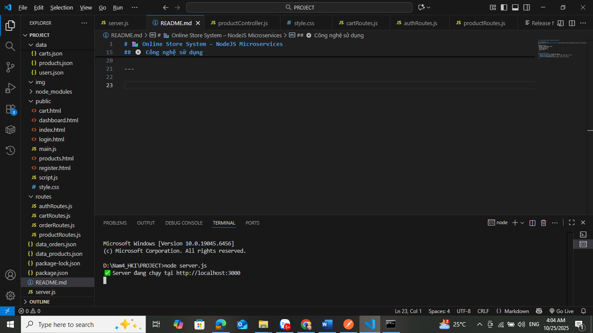
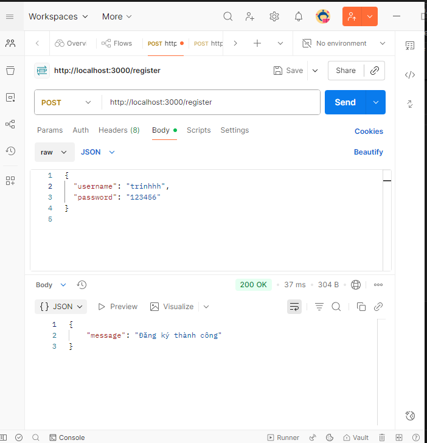
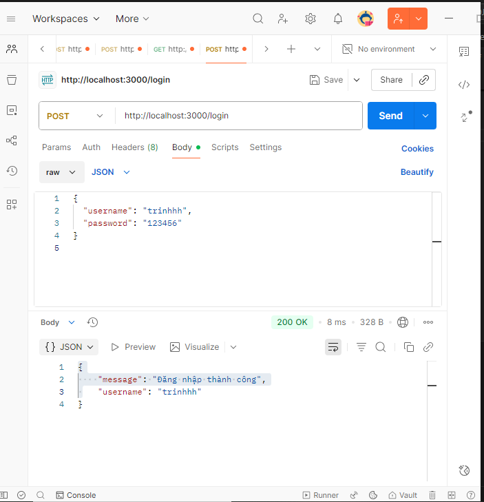
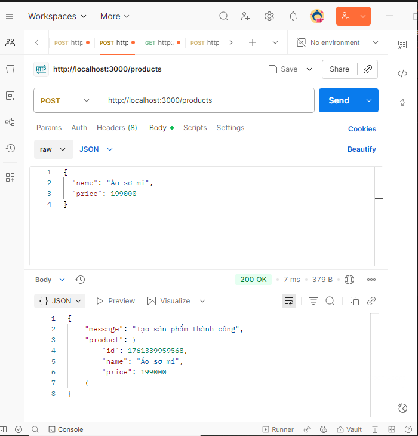
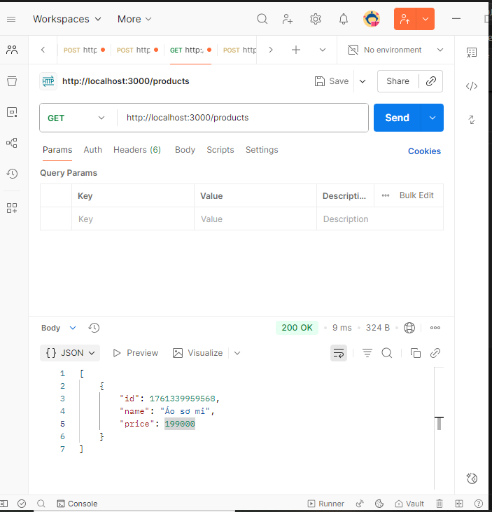
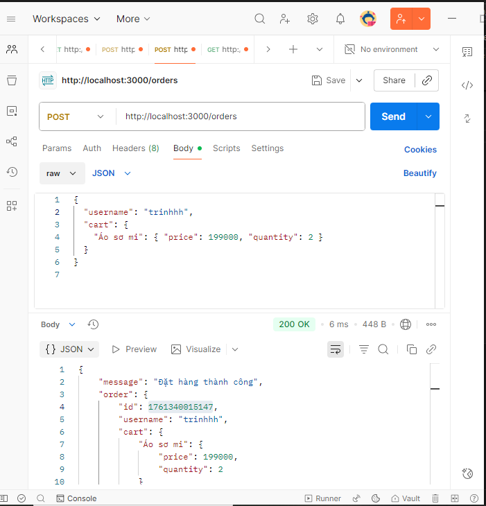
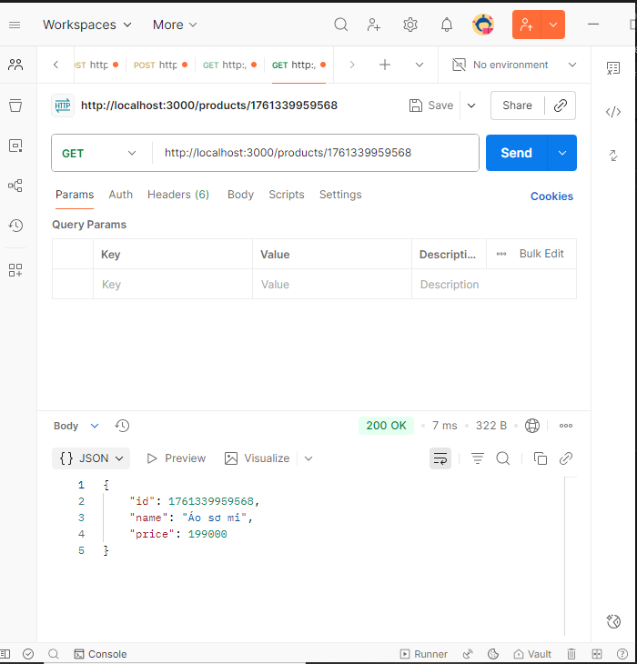

# 🛍️ Online Store System – NodeJS Microservices

## 🧾 Giới thiệu dự án
Dự án mô phỏng **hệ thống bán hàng trực tuyến** gồm nhiều dịch vụ nhỏ (microservices) giao tiếp với nhau qua **RESTful API**.

Người dùng có thể:
- Đăng ký và đăng nhập tài khoản.
- Xem danh sách sản phẩm.
- Thêm sản phẩm mới.
- Lấy sản phẩm theo ID.
- Tạo đơn hàng.

---

## ⚙️ Công nghệ sử dụng
- **Node.js + Express.js** – tạo REST API backend.
- **MongoDB hoặc file JSON** – lưu trữ dữ liệu sản phẩm, người dùng, đơn hàng.
- **Postman** – dùng để kiểm thử API.
- **HTML/CSS/JS** – giao diện hiển thị sản phẩm và đặt hàng trên local.

     